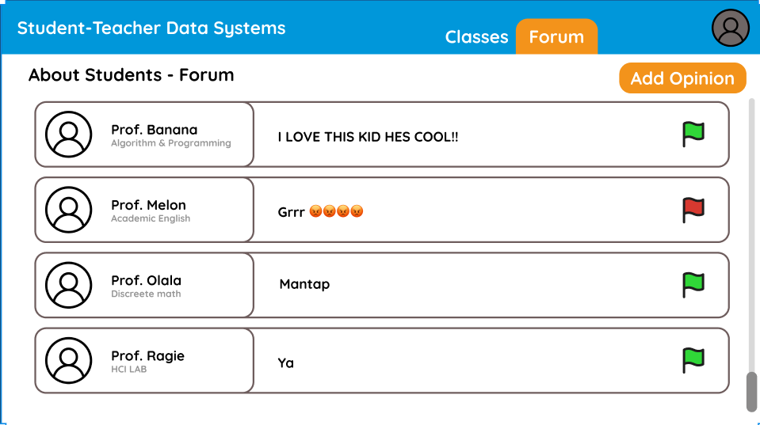
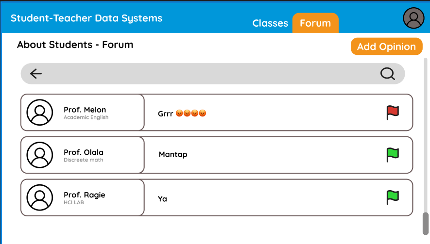

# HCI_Quiz2

## Profile
Name: Agie Winata  
Id: 2902642726

## changes:
first img:

last img:

Explanation:  
Added a search bar, back button, and search icone in order to let user search their own desired inputs.  The other buttons would also aid user in navigation and data presentation.

## navigation pattern

first img:

last img:

Explanation:  
The image above shows the usage of navbar as the navigation pattern.  
The navbar is used as it is one of the most used navigation pattern in the industry,  
hence many people would be familiar with the concept of it. not only that,  
a navbar is one of the most simplest yet most effectvit, navigation pattern to implement, making it  very ideal for developers to implement.

## input and forms

first img:

last img:

Explanation:  
The web page feature a text box in order for user to input text of their own making.  
On top of that search box, there exist a label that would help clear any misunderstanding  
that the use would have regarding the function of the search box. When entering text  
user can expect to not be confuse at to what to enter, since it has already been it has  
already been labeled.

## feedback & status
first img:

last img:

explanation:  
The button of this webpage would provide feedback. This fits our intended purposes as  
it we want users to not be confused wheter certain features or our webpages are working.  
We hope that this feature would allow user to detect whether or not a certain part of the webpage is working or not.  

## Layout Strcture:
first img:

last img:

Explanation:  
The web page features a list style type of layout to present its data.  
This would help user to digest the data presented, as a list helps with  
formating data in a low-density manner, making it easier to understand.  
It fits our desiered purpuse as we want users to understand the data that  
we have provided them. When interacting with the webpage user can expecy 

## Data Presentation
first img:

last img:

Explanation:  
Since the all of the information are insed of a list, user are able to  
compare different data that the webpage have with ease. Not one that,  
Not only that the flag button also give a brief summary regarding the sentiment  
of the data.

## tables

